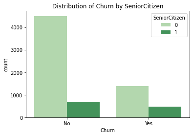

# Telco Customer Churn Prediction: Project Overview 
- Created a tool that predicts whether or not a customer will churn from Telco
- Engineered two new features, volume and ratio, from the given features
- Optimized a Random Forest regressor using GridSearchCV to reach the model

# Data Cleaning and Feature Engineering
- Replaced empty values in TotalCharges column with a null value
- Dropped all rows with null values
- Converted all columns with integer values into float values
- Replaced all values with 'No internet service' or 'No phone service' into 'No' for simplicity
- Dropped id column
- Added a new column, TC_to_ten_ratio, which divided a customer's total charges by their tenure
- Made new dummy columns for age, divided into five different age groups
- Added a total_services column, which summed all the different services a customer had with Telco
- Label encoded categorical columns with only two distinct values
- Created dummy variables for categorical columns with more than two distinct values
- Converted churn column from yes/no to 1/0
- Scaled the numerical columns

# Data Visualisation

# Model Building
#### I tried 6 different models and compared them based on F1 score ####
- Logistic Regression: F1 = 0.59
- Naive Bayes: F1 = 0.64
- K Nearest Neighbors: F1 = 0.55
- Decision Tree: F1 = 0.47
- Random Forest: F1 = 0.58
- Support Vector Machine: F1 = 0.57

